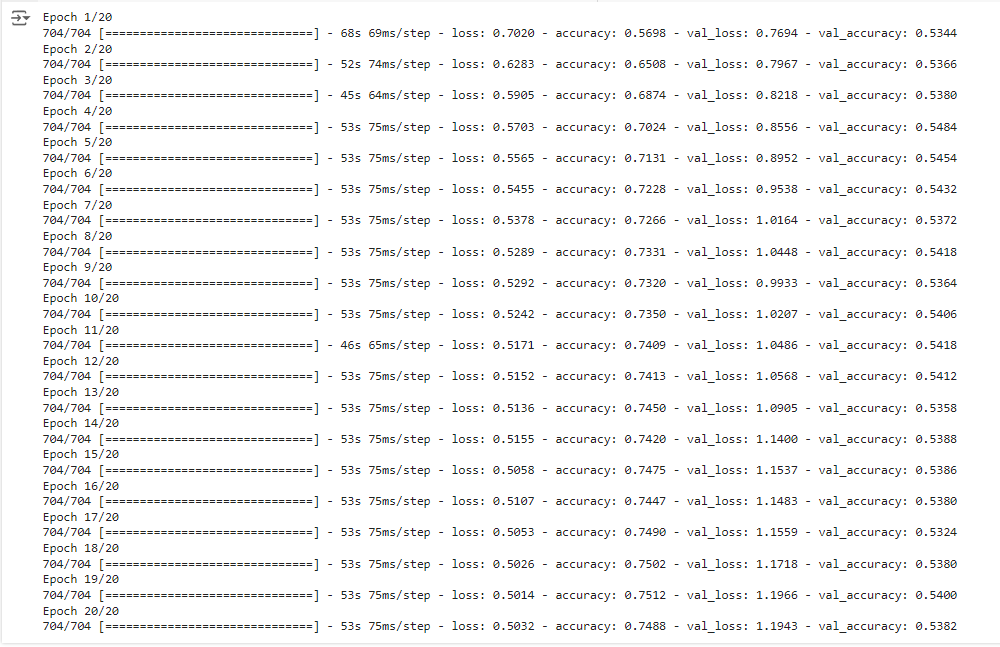

# Classificação de Imagens Few-Shot Learning de Gatos e Cães com Redes Siamesas (CIFAR-10)

> Este artigo apresenta a correção e aprimoramento de um código originalmente desenvolvido por um colega, focado na classificação de imagens de gatos e cães utilizando redes siamesas. O código original apresentava problemas na estruturação dos dados de treinamento, que foram corrigidos para considerar adequadamente os pares de imagens e as entradas distintas para cada lado da rede siamesa.

## Introdução

A classificação de imagens de gatos e cães é um problema clássico em visão computacional. Este artigo detalha as etapas de correção e aprimoramento de um código que inicialmente não considerava a estrutura necessária para redes siamesas, ajustando-o para separar corretamente as imagens em pares e treinar a rede utilizando entradas distintas.

## Sobre o Problema

O código original não levava em consideração a estrutura de redes siamesas, falhando em separar as imagens em pares adequados e usando o mesmo conjunto de dados em ambos os lados da rede. A correção envolveu a criação de pares de imagens, considerando duas entradas distintas para a rede siamesa, o que é essencial para seu funcionamento correto.

**Link para o dataset:**

- [CIFAR-10 Dataset](https://www.cs.toronto.edu/~kriz/cifar-10-python.tar.gz)

## Objetivos e Metodologia

### Objetivos

- **Corrigir a estrutura de dados para redes siamesas:** Ajustar o código para criar pares de imagens e separar corretamente os conjuntos de dados para cada lado da rede.
- **Implementar e treinar a rede siamesa:** Utilizar uma rede siamesa com a arquitetura Xception para classificar imagens de gatos e cães.
- **Avaliar o desempenho do modelo:** Medir a precisão e outras métricas relevantes para avaliar a eficácia da correção e do treinamento do modelo.

### Metodologia

- **Carregar e pré-processar os dados:** Filtrar as classes de interesse (gatos e cães) e normalizar as imagens.
- **Criar pares de imagens:** Gerar pares de imagens com rótulos binários indicando se pertencem à mesma classe.
- **Definir e treinar a rede siamesa:** Construir a rede siamesa com a arquitetura Xception, ajustando os pesos durante o treinamento.
- **Avaliar o modelo:** Utilizar métricas como acurácia e F1 score para medir o desempenho do modelo em conjuntos de teste e validação.

## Construção e Treinamento do Modelo

### Arquitetura da Rede Siamesa

A rede siamesa foi construída utilizando a arquitetura Xception, com ajustes para considerar duas entradas distintas e calcular a distância L1 entre os embeddings das imagens.

### Treinamento do Modelo

O modelo foi treinado utilizando os pares de imagens gerados, com 20 épocas e um tamanho de batch de 32.

## Avaliação do Modelo

### Avaliação no Conjunto de Teste

Avaliar o modelo no conjunto de teste é crucial para medir seu desempenho em dados não vistos. Utilizamos métricas como acurácia e F1 score para uma avaliação detalhada.

## Resultados

## Conclusão

A correção do código e a implementação adequada de uma rede siamesa permitiram uma classificação mais precisa de imagens de gatos e cães. Este estudo destaca a importância de estruturar corretamente os dados e ajustar a arquitetura da rede para obter melhores resultados em tarefas de visão computacional.